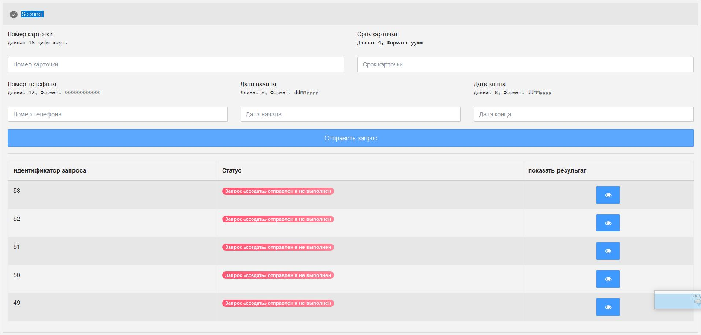
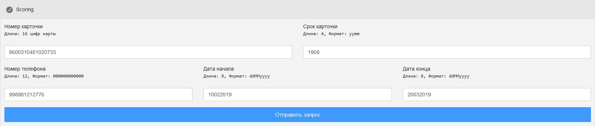
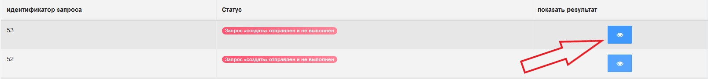

# Scoring - SVGate
## Scoring uchun ma'lumotlar turi
Scoring tizimini orqali foydalanuvchi uchun SVGate tizimidan bal olinadi. Bal olish uchun quyidagi ma'lumotlarni kiritish talab etiladi:
- `Karta raqami` (Номер карточки, Длина: 16 цифр карты) - plastik karta ustidagi raqamlar bo'lib, ajratilmasdan yoziladi.
- `Kartaning amal qilish muddati` (Срок карточки, Длина: 4, Формат: yymm) - Kartaning amal qilish muddati. Odatda kartalarda amal qilish muddatida avval oy kegin yil yoziladi, bizning tizimda esa avval yil kegin oy kiritilishi talab qilinadi
- `Telefon raqam` (Номер телефона, Длина: 12, Формат: 000000000000) - Karta biriktirilgan telefon raqam bo'lib, karta uchun ushbu kartada sms xizmati yoqilgan bo'lishi talab etiladi. Kitirilish tartibi 998yyxxxxxx ko'rinishida bo'lib, `+` belgisi ishlatilishi mumkin emas.
- `Boshlanish vaqti` (Дата начала, Длина: 8, Формат: ddMMyyyy) - Muddatli to'lovning boshlanish vaqti.
- `Tugash vaqti` (Дата начала, Длина: 8, Формат: ddMMyyyy) - Muddatli to'lovning tugash vaqti.

!> Yuqoridagi vaqt bilan bog'liq formatlarda `d` - kun, `M` - oy, `y` - yilni bildiradi. `dd` - formatida oyning 3-kuni `03` ko'rinishida yoziladi, `MM` formatida iyul oyi `07` ko'rinishida yoziladi, `yyyy` formatida bu yil `2019` ko'rinishida yoziladi.

## Scoringdan foydalanish
Scoringdan foydalanish uchun Istalgan buyurtma ichidan scoring uchun ajratilgan `Scoring` bo'limidagi forma to'ldiriladi va `Отправить запрос` tugmasi bosilgan holda so'rov yuboriladi.

Scoring formasi yuqorida keltirilgan ma'lumot turlaridan foydalangan holda quyidagicha to'ldiriladi:

Forma to'ldirilganda uning pastki qismida jo'natilgan so'rovlarning eng oxiridan boshlab teskari tartibda so'rovlar ro'yhati chiqariladi. Bu ro'yhatda so'rovning tartib raqami va uning qanday holatda yakunlanganligi va agarda muvofaqqiyatli yakunlangan bo'lsa to'plangan ballar haqida ma'lumot chiqariladi.

## Scoring jarayonidagi xatoliklar
Scoring tizimida kiritilgan ma'lumotlardan tashkil topgan so'rov boshqa bir serverga jo'natiladi va u serverdan kelgan ma'lumotlar shunchaki chiqariladi, ya'ni `The Mall` tizimi hech qanday hisob kitob ishlarini amalga oshirmaydi. So'rov jo'natishda `IPsec` foydalanilganligi uchun SVGate tomidan berilgan **ip** va joriy tizimdagi **ip** manzillari mos kelmaydi.

Scoring so'rovining quyidagi ko'rinishda statuslari bo'lishi mumkin:
- Запрос запущен, но не завершен - Bunda so'rov ishga tushuriladi, lekin SVGate yoki IPsec dagi muammolar sababli so'rov bajarilishi kechikishi kuzatiladi.
- Запрос «создать» отправлен, но не завершен - Bunda `create` so'rovi yuboriladi ammo javob kelishi IPsec dagi muammolar sababli so'rov bajarilishi kechikishi kuzatiladi.
- Запрос «создать» отправлен и успешно завершен - Bunda `create` so'rovi muvofaqqiyatli yakunlanadi.
- Запрос «создать» отправлен и не выполнен - Bunda `create` so'rovi yaratiladi ammo noma'lum sabab bilan yakunlanmaydi.
- Запрос «получить» отправлен, но не завершен - Bunda `get` so'rovi jo'natiladi, lekin kutish holatida bo'ladi.
- Запрос «получить» отправлен и успешно завершен - Bunda `get` so'rovi muvofaqqiyatli yakunlanadi.
- Запрос «получить» отправлен и не выполнен - Bunda `get` so'rovi so'rovi yaratiladi ammo noma'lum sabab bilan yakunlanmaydi.

!> `create` va `get` so'rovlari bir biriga bog'liq bo'lib, avval `create` kegin esa `get` so'rovi ishga tushiriladi. `create` so'rovining natijasi `get` so'rov uchun foydalanilganligi sababli `create` so'rovi albatta muvofaqqiyatli yakunlashini zarur.

Scoring ishlatish vaqtida xatolik yuzaga kelsa avvalo jo'natilgan so'rovlar ro'yhatining o'ng tarafidagi ko'rish tugmasini bosish kerak bo'ladi:

Bu orqali quyidagi ko'rinishdagi xatoliklarni ko'rib chiqish mumkin bo'ladi:

`To'g'ri so'rovning` ko'rinishi esa quyidagicha bo'lishi kerak:

# Avto xisobdan pul yechish - SVGate